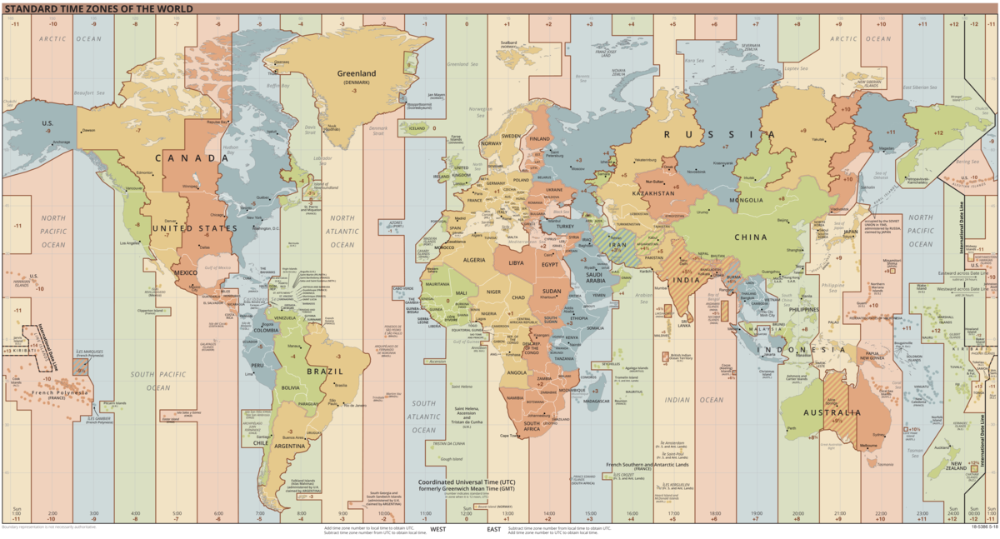

이번에 회사일을 하면서 UTC, 타임존, Date...을 다뤘었는데, 이 과정에서 공부했던 내용들을 다시 한번 정리하는 의미에서 이 글을 작성하게 되었습니다.

## GMT와 UTC

우리는 시차의 개념을 알고 있습니다. 지금 이순간, 서울은 밤 10시 50분이지만 미국은 아침 6시 50분입니다. 또 영국은 오후 2시 50분입니다. 이처럼 ```현재```를 기준으로 각 나라는 다른 시간대를 가집니다(사실 이건 지구가 자전을 하기 때문에 당연한 현상입니다). 여기서 우리는 ```현재```라는 기준점이 되는 시간을 알 필요가 있습니다.

### GMT(Greenwich Mean Time)

역사적으로 GMT가 UTC보다 훨씬 이전에 나온 개념입니다. UTC는 20세기 후반에 등장한 개념이지만, GMT는 이미 16세기에 나온 개념입니다. UTC를 이해하려면 GMT를 알아야 하며, 먼저 GMT를 제대로 이해하기 위해서는 M(mean)의 의미를 잘 이해해야 합니다.

과거에는 태양을 기준으로 하루를 정의하였습니다. 낮12시, 태양이 가장 높은 고도에 있을 때를 기준으로 오늘 12시~내일 12시를 하루로 정의하였습니다. 이처럼 태양의 고도를 기준으로 시간을 정한 것이 태양시(Solar Time)입니다.

하지만 여기서 문제는 지구의 공전궤도, 자전축의 문제로 하루의 길이가 일정하지 않다는 것입니다. 그래서 1년 동안의 태양시를 모두 측정하여 평균을 낸 시간을 사용해야 하고, 이것은 평균시(Mean Time)이라고 부릅니다.

이후 17세기 영국의 그리치니 천문대가 지어 지면서 정확한 평균시를 측정해서 시계의 시간을 맞추었고 이것이 **GMT**입니다.

GMT는 1925년 2월 5일부터 사용하여 1972년 1월 1일 까지 세계 표준시로 사용하였습니다.

&nbsp;

### UTC

GMT에서 중요한 것은 평균시 입니다. 지구 운동에서 하루의 평균 시간을 구하고 여기서 1/24를 1시간, 1시간의 1/60을 1분, 1분의 1/60를 1초로 정의하였습니다.

하지만 과학이 발전되면서 자전의 속도가 일정하지 않다는 것을 발견하였습니다. 이후 태양 대신에 새로운 기준점을 찾아야 했습니다. 현재로서는 ```원자 시계```가 가장 정확도가 높으며, 1967년 국제도량형회의에서 1초는 세슘원자에서 에너지 방출이 91억 9263만 1770회 일어나는 시간으로 정의합니다.

UTC는 기본적으로 원자시계를 기반으로 하며 1초 단위의 시간까지만 맞춰놓았습니다(0.2초는 다루지 않음).
현재 UTC는 1972년 1월 1일 부터 ```협정세계시``` 즉, 세계 표준시로 정의되었습니다.

> UTC를 처음 정할 떄 영어권에서는 CUT(Coordinated Universal Time), 프랑스어권에서는 TUC(Temps Universel Coordonn)로 하기를 원했고, 결국 합의를 보지 못하고 모두 U,T,C가 포함되었기 때문에 UTC로 정해졌다고 합니다.

&nbsp;

### UTC, GMT ?

사실 UTC, GMT 모두 세계 표준시를 정의하기 위해 존재하며 실제로는 초의 소숫점 단위에서만 차이가 납니다. 때문에 값으로는 크게 차이가 없습니다. 하지만 현재 UTC를 세계 협정시로 사용하고 있기 때문에 GMT보다는 UTC를 사용하는 것이 더 적절합니다.

&nbsp;

## 타임존(Time Zone)과 오프셋(off set) 그리고 서머타임(DST)

타임존은 동일한 시간을 가지는 구역을 의미합니다. 한국과 일본의 time zone은 모두 UTC+09:00입니다. 여기서 +09:00은 off set정보를 의미하며 UTC시간보다 9시간 더 빠르다는 것을 의미합니다. 영국을 기준으로 오른쪽은 +, 왼쪽을 -값을 가집니다. [여기](https://en.wikipedia.org/wiki/Time_zone)를 보면 동일한 time zone을 가지는 국가들을 확인할 수 있습니다.

아래의 사진을 보면 세계 지도를 x축을 기준으로 나누어 같은 time zone을 가지는 것을 확인할 수 있는데 이것은 지구가 자전을 하기 때문입니다. 개인적인 생각은 태양빛을 받는 부분이 같아서 그런 것 같습니다.



### 서머타임(DST)

우리에게는 익숙하지 않지만 서머타임(DST)라는 것이 있습니다. 이는 ```여름엔 해가 기니 겨울보다 1시간씩 일찍 당겨서 생활하면 해가 떠 있는 동안 더 많은 일을 할(시킬) 수 있다```라는 벤저민 프랭클린의 아이디에서 시작한 제도이며 하절기에는 일반적인 시간보다 한 시간 앞당긴 것을 의미합니다. 과거에는 조명을 설치하는 것이 모두 비용이었으며 해가 긴 여름에는 한 시간 앞당겨 생활하여 해가 남아있을 때 더 많은 활동하자는 의미로 서머타임이 도입되었습니다.

미국과 캐나다는 거의 서머타임을 실시합니다. 하지만 미국의 경우 애니조나 주와 하와이 주는 일조량이 워낙 많기 때문에 서머타임을 적용하지 않습니다. 중미의 경우 멕시코만 서머타임을 적용하기에 적합하지 않지만 미국과의 교류 증대를 위해 실시합니다.

한국의 경우 1948년~1960년 까지 시행했다가 결국 중단하였고, 1987년에 88올림픽 때문에 잠시 복원했다가 올림픽이 끝나고 바로 폐지하였습니다.

### IANA time zone DB

위의 내용을 정리하면 타임존은 동일한 시간을 가지는 구역을 의미하며, 하나의 타임존에서 오프셋 정보는 시간, 정치, 경제상황에 따라 계속 달라질 수 있습니다.

이렇게 각 상황의 변화를 정리하여 하나의 표준으로 만든 것이 [IANA time zone DB](https://www.iana.org/time-zones)라고 하며 전 세계의 모든 지역 표준시와 DST 변경 내역을 담고 있습니다.

Area/Location 규칙으로 정의되며 한국과 일본 모두 UTC+09:00을 가지지만 실제로 역사적인 배경이 다르고 각각 다른 나라이므로 별도의 타임존으로 관리됩니다.

&nbsp;

## Date 생성자

Date는 생성자 함수입니다. Date 생성자 함수로 생성한 Date 객체는 내부적으로 시간을 나타내는 ```정수값```을 갖습니다. 이 값은 1970년 1월 1일 00:00:00(UTC)을 기점으로 Date 객체가 나타내는 날짜와 시간까지의 ```밀리초```를 나타냅니다.

예를 들어, 1970년 1월 1일 0시를 기점으로 하루가 지난 1970년 1월 2일 0시를 나타내는 Date객체는 내부적으로 정수값 86,400,000(24h x 60m x 60s x 1000ms)을 갖습니다.

Date 생성자 함수로 생성한 Date 객체는 기본적으로 현재 날짜와 시간을 나타내는 정수값을 가집니다. 현재 날짜와 시간이 아닌 다른 날짜와 시간을 다루고 싶은 경우 Date 생성자 함수에 ```명시적으로 해당 날짜와 시간 정보를 인수로 지정```합니다.

Date 객체를 생성하는데는 4가지 방법이 있습니다.

### 1. new Date()

매개변수를 제공하지 않으면, 생성 순간의 날짜와 시간을 나타내는 Date 객체를 생성합니다. 이는 어느 타임존에 있는지 상관없이 항상 UTC+0 시간을 기준으로 Date 객체를 만듭니다.
기본적으로 ```Date 타입```을 가지지만, new 없이 호출하면 날짜와 시간 정보를 나타내는 ```문자열```을 반환합니다.

```js
- time zone : UTC+9
1. new Date() // 2021-07-07T09:38:14.511Z
2. Date()     // 'Wed Jul 07 2021 18:46:38 GMT+0900 (Korean Standard Time)'

- time zone : UTC+0
1. new Date() // 2021-07-07T09:38:14.511Z
2. Date()     // 'Wed Jul 07 2021 09:46:53 GMT+0000 (Coordinated Universal Time)'
```

&nbsp;

### 2. new Date(milliseconds)

Date 생성자 함수에 숫자 타입의 ms를 인수로 전달하면 1970년 1월 1일 00:00:00(UTC)을 기점으로 인수로 전달된 밀리초만큼 경과한 날짜와 시간을 나타내는 Date 객체를 반환합니다.
1970년 1월 1일 00:00:00을 기준으로 몇 ms이 흘렀는지를 계산하기 떄문에 time zone의 영향을 받지 않습니다.

```js
- time zone : UTC+9
new Date(0)        // 1970-01-01T00:00:00.000Z
new Date(86400000) // 1970-01-02T00:00:00.000Z

- time zone : UTC+0
1970-01-01T00:00:00.000Z
new Date(86400000) // 1970-01-02T00:00:00.000Z
```

&nbsp;

### 3. new Date(dateString)

Date 생성자 함수에 전달하는 문자열은 Date.parse 메서드에 의해 해석가능한 포맷([ISO 8601](https://ko.wikipedia.org/wiki/ISO_8601), [RFC 2822](https://datatracker.ietf.org/doc/html/rfc2822#section-3.3))이여야 하며 기본적으로 아래의 포맷을 가집니다.

```
YYYY-MM-DDTHH:mm:ss.sssZ
```

- 2020-12-30
- 2020-12-30T20:59
- 2020-12-30T20:59:00
- 2020-12-30T20:59:00.000Z
- 2020-12-30T20:59:00.000+01:00
- 2020-12-30T20:59:00.000-01:00
- ...

시간표현의 시작점을 알리기 위해 날짜와 시간사이에 T를 추가하며 만약 UTC시간대면 ```Z```를 추가하거나 time zone offset을 표현하기 위해 ```±HH:mm```을 추가합니다.

```js
- UTC+9 환경
new Date('2020-12-30T20:59:00.000')        // 2020-12-30T11:59:00.000Z
new Date('2020-12-30T20:59:00.000+09:00')  // 2020-12-30T11:59:00.000Z
new Date('2020-12-30T20:59:00.000Z')       // 2020-12-30T20:59:00.000Z
```

만약 문자열에 어떠한 time zone offset정보가 없으면 로컬시간의 영향을 받아 **현재 로컬 시간은 UTC+9니깐 2020-12-30T20:59:00.000은 UTC시간에서 -9시간이겠구나**라고 해석합니다. 반면 ```Z```,```+09:00```의 경우 offset 정보를 주었기 때문에 UTC시간으로 해석합니다.

&nbsp;

### 4. new Date(year,month[, day, hour, minute, second, millisecond])

인수로 년, 월, 일, 시, 분, 초, 밀리초를 의미하는 숫자를 전달하면 지정된 날짜와 시간을 가지는 인스턴스를 반환한다. 이때 ```년, 월은 반드시 지정하여야 하며``` 지정하지 않으면 0또는 1로 초기화 됩니다.

출력되는 모든 값은 로컬시간의 영향을 받습니다.

|인수|내용
|--|--|
|year|1900년 이후의 년|
|month|월을 나타내는 0~11까지의 정수(0은 1월)|
|day|일을 나타내는 1 ~ 31까지의 정수|
|hour|시를 나타내는 0 ~ 23까지의 정수|
|minute|분을 나타내는 0 ~ 59까지의 정수|
|second|초를 나타내는 0 ~ 59까지의 정수|
|millisecond|밀리초를 나타내는 0 ~ 999까지의 정수|

## 서버에서 날짜 다루기

서비스를 한국에서만 할것이라면 서버의 시간을 KST(UTC+9)로 해도 큰 문제가 없을 것입니다. 하지만 여러 time zone을 고려한 서비스를 만들어야 한다면 서버에서의 날짜는 UTC를 사용해야 합니다.

예를 들어 뉴욕시간은 2021-07-13 10:38이고 한국은 2021-07-13 11:38일 때, 만약 DB에 한국시간을 기준으로 저장하게 되면, 뉴욕에서 표시할 때 뉴욕-한국 시간의 시차를 매번 계산하여 보여주어야 할 것 입니다.
만약 다른 나라가 추가된다면 그때마다 한국과의 시차를 계산해야 합니다.

이런 방법대신 보통 서버에는 유닉스 시간이나 오프셋 정보가 포함된 ISO 8601 형태로 저장해야 합니다. 한국에서의 2021-07-13 11:38는 ```2021-07-13T11:38+09:00(ISO 8601)```이나 ```1626143880000(유닉스 시간)```의 형태로 관리해야 합니다.

최근 여러 open api를 사용하면서 받은 날짜 데이터를 아래와 같습니다.

|날짜|UTC+0|UTC+9
|--|--|--|
|2021-06-09T18:15:36+09:00|2021-06-09T09:15:36.000Z|2021-06-09T09:15:36.000Z
|2021-03-05T04:54:32.00Z|2021-03-05T04:54:32.000Z|2021-03-05T04:54:32.000Z|
|2021-04-07 16:07:15|2021-04-07T07:07:15.000Z|2021-04-07T16:07:15.000Z|
|20210506162625|Invalid Date|Invalid Date
|...|...|...

```2021-06-09T18:15:36+09:00```와 ```2021-03-05T04:54:32.00Z```는 각각 off set정보, UTC 지정자를 포함하기 때문에 UTC 시간으로 해석되며 time zone에 상관없이 모두 같은 값을 가집니다. 반면 ```2021-04-07 16:07:15```는 어떠한 off set 정보가 없기 때문에 local 시간을 따라갑니다.

한편 ```20210506162625의```는 Date.parse에 의해 해석되지 않으며 Invalid Date로 나오게 됩니다. 이런 경우 직접 time zone offset 정보나 Z가 추가된 ISO 8601 형식으로 문자열을 수정해주어야 합니다.

어찌되었든 중요한 것은 서버에서의 날짜는 UTC로 관리 되어야 한다는 것입니다.

## 📖 Reference

- <https://meetup.toast.com/posts/130>
- <https://ko.wikipedia.org/wiki/ISO_8601>
- <https://262.ecma-international.org/6.0/#sec-date.parse>
- <https://developer.mozilla.org/ko/docs/Web/JavaScript/Reference/Global_Objects/Date/Date>
