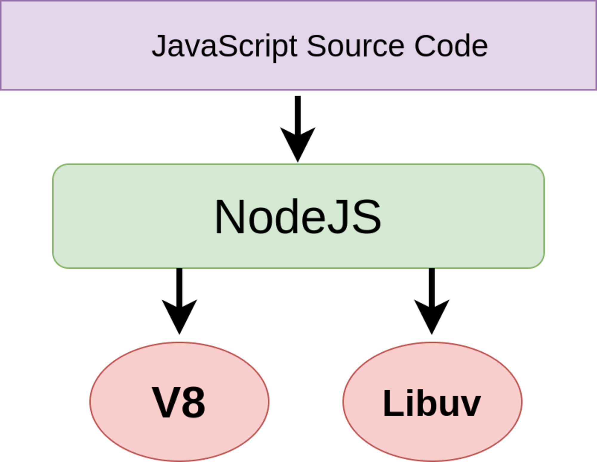
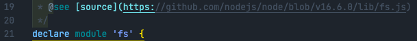

## what is nodejs ?

javascript는 Netscape에 의해 만들어진 프로그래밍 언어입니다. 브라우저에서 버튼을 눌렀을 때 색상이 변경된다거나, 팝업창이 뜨는 등 주로 browser에서 화면을 조작하기 위해 사용하였습니다.
하지만 2009년 node.js가 등장하면서 javascript는 단지 browser에서 화면을 조작하는데 그치지 않고 파일을 읽거나, network I/O, process...등 브라우저 밖에서 동작할 수 있게 되었습니다.

[node.js 공식문서](https://nodejs.org/en/)에 들어가면 node.js를 다음과 같이 소개하고 있습니다.

```
Node.js® is a JavaScript runtime built on Chrome's V8 JavaScript engine.

```

여기서 runtime은 javascript가 `실행되는 환경`을 의미합니다. 다른 글에서는 platform, 자바스크립트 실행기 등으로 불리는데 모두 맞는 표현입니다. 어쨋든 중요한 것은 우리가 작성한 코드를 실행하는 `환경`이라는 것입니다.

여기서 잠시 engine과 runtime의 차이에 대해 알아 보겠습니다.

- engine : javascript로 작성된 코드를 기계가 실행할 수 있는 언어로 변환하고 실행하는 프로그램
- runtime : javascript가 실행 되면서 사용할 수 있는 여러 라이브러리를 제공합니다. 브라우저에서 실행되는 경우 여러 DOM API를 제공하며, node환경에서 실행되는 경우 cluster, fs..등의 API를 사용할 수 있습니다.

javascript engine은 V8(chrome), 차크라(explorer), 웹킷(safari)..등이 있으며 node.js는 chrome의 V8엔진을 사용하고 있습니다.
즉 우리가 작성한 코드는 V8엔진에 의해 해석되고 실행되며 node.js runtime에서 동작하고 있습니다.

```
nodejs : V8 + libuv

nodejs : js(50%) + c++(50%)
V8 : js(30%) + c++(70%)
libuv : c++(100%)
```

nodejs는 v8과 libuv로 이루어져 있으며, js와 c++를 사용하여 구현되었습니다.
c++은 하드웨어에 접근할 수 있는 low-level 코드로 구성되어 있으며 javscript는 nodejs 모듈을 구현하는 코드 이며 V8 엔진에 의해 실행됩니다.



## 우리가 작성한 fs 코드는 어디있을까 ?

node.js는 다양한 라이브러리를 지원합니다. [여기](https://nodejs.org/dist/latest-v14.x/docs/api/)에서 필요한 모듈을 찾아 문서를 보고 잘사용하면 됩니다. 딱히 내부 코드가 어떻게 돌아가는지 확인할 필요는 없지만, 그래도 우리가 작성한 코드가 nodejs에 어떻게 존재 하는지 눈으로 직접 본다면 nodejs와 좀 더 친해질 것(?) 같습니다.

```js
var fs = require('fs')

fs.writeFile('fiel.txt', data, 'utf8', function(error) {
  console.log('end')
})
```

fs 모듈을 사용하여 파일을 읽는 코드입니다. 이 코드를 시작으로 우리는 nodejs 실제 코드로 들어가겠습니다. `('fs')` 부분에 마우스를 올리고 command + click을 하면 fs.d.ts파일로 이동하게 됩니다.



그러면 아래와 같은 코드를 볼 수 있는데요, 이곳에 우리가 사용하는 fs API가 정의되어 있습니다.

> [node.js github](https://github.com/nodejs/node)의 lib폴더는 node.js에서 제공하는 모듈이 javascript로 구현되어 있으며, src 폴더는 node.js의 모듈의 실제 구현과 libuv,V8 코드가 존재합니다.

lib/fs.js파일의 [line 2844](https://github.com/nodejs/node/blob/v16.6.0/lib/fs.js#L2844)의 `module.exports = fs = { ...}` 코드는 fs 에서 사용할 수 있는 모든 api를 export하고 있으며 덕분에 우리는 fs 메서드를 사용할 수 있습니다.

[line 2090](https://github.com/nodejs/node/blob/v16.6.0/lib/fs.js#L2090)을 보면 우리가 파일을 만드는데 사용한 `writeFile` API가 있습니다.

```js
function writeFile(path, data, options, callback) {
  callback = maybeCallback(callback || options)
  options = getOptions(options, { encoding: 'utf8', mode: 0o666, flag: 'w' })
  const flag = options.flag || 'w'

  if (!isArrayBufferView(data)) {
    validateStringAfterArrayBufferView(data, 'data')
    data = Buffer.from(String(data), options.encoding || 'utf8')
  }

  if (isFd(path)) {
    const isUserFd = true
    const signal = options.signal
    writeAll(path, isUserFd, data, 0, data.byteLength, signal, callback)
    return
  }

  if (checkAborted(options.signal, callback)) return

  fs.open(path, flag, options.mode, (openErr, fd) => {
    if (openErr) {
      callback(openErr)
    } else {
      const isUserFd = false
      const signal = options.signal
      writeAll(fd, isUserFd, data, 0, data.byteLength, signal, callback)
    }
  })
}
```

`writeFile`은 내부적으로 `writeAll` API를 사용하고 으며 `writeAll`은 다시 내부적으로 `fs.write`을 사용하고 있습니다.
`write` API는 [line 795](https://github.com/nodejs/node/blob/v16.6.0/lib/fs.js#L795)에 구현되어 있습니다.

```js
function write(fd, buffer, offset, length, position, callback) {
  function wrapper(err, written) {
    // Retain a reference to buffer so that it can't be GC'ed too soon.
    callback(err, written || 0, buffer);
  }

  fd = getValidatedFd(fd);

  if (isArrayBufferView(buffer)) {
    callback = maybeCallback(callback || position || length || offset);
    if (offset == null || typeof offset === 'function') {
      offset = 0;
    } else {
      validateInteger(offset, 'offset', 0);
    }
    if (typeof length !== 'number')
      length = buffer.byteLength - offset;
    if (typeof position !== 'number')
      position = null;
    validateOffsetLengthWrite(offset, length, buffer.byteLength);

    const req = new FSReqCallback();
    req.oncomplete = wrapper;
    return binding.writeBuffer(fd, buffer, offset, length, position, req);
  }
```

중요한 점은 함수의 return값이 `binding.writeBuffer(...)`이라는 것입니다. 여기서 binding은 ([line 70](https://github.com/nodejs/node/blob/v16.6.0/lib/fs.js#L70))에 정의되어 있습니다.

```js
const { fs: constants } = internalBinding('constants')
...
const pathModule = require('path')
const { isArrayBufferView } = require('internal/util/types')

// We need to get the statValues from the binding at the callsite since
// it's re-initialized after deserialization.

const binding = internalBinding('fs')
```

사실 우리가 작성하는 모든 코드는 javascript이자만 실제로 fs 작업을 수행하는 부분은 c++코드 입니다. 이런 c++ 코드는 src/\*에 정의되어 있고 javascript API와 매핑되며 이렇게 javascript 코드와 c++코드를 엮어주는 부분이 위의 코드에서 `binding`입니다.

[src/node_file.cc](https://github.com/nodejs/node/blob/master/src/node_file.cc)에 javascript에서 fs의 모든 API가 여기 파일에 정의되어 있습니다.

우리가 javascript파일에서 binding.writeBuffer을 call할 수 있었던 이유는 [line 2492](https://github.com/nodejs/node/blob/master/src/node_file.cc#L2492)에서 다음과 같이 처리해주었기 때문입니다.

```js
...
env->SetMethod(target, "writeBuffer", WriteBuffer);
...
```

WriteBuffer의 구현 코드는 [line 1998](https://github.com/nodejs/node/blob/master/src/node_file.cc#L1887)에 정의되어 있습니다.

```js
static void WriteBuffers(const FunctionCallbackInfo<Value>& args) {
  Environment* env = Environment::GetCurrent(args);

  const int argc = args.Length();
  CHECK_GE(argc, 3);

  CHECK(args[0]->IsInt32());
  const int fd = args[0].As<Int32>()->Value();

  CHECK(args[1]->IsArray());
  Local<Array> chunks = args[1].As<Array>();

  int64_t pos = GetOffset(args[2]);

  MaybeStackBuffer<uv_buf_t> iovs(chunks->Length());

  for (uint32_t i = 0; i < iovs.length(); i++) {
    Local<Value> chunk = chunks->Get(env->context(), i).ToLocalChecked();
    CHECK(Buffer::HasInstance(chunk));
    iovs[i] = uv_buf_init(Buffer::Data(chunk), Buffer::Length(chunk));
  }

  FSReqBase* req_wrap_async = GetReqWrap(args, 3);
  if (req_wrap_async != nullptr) {  // writeBuffers(fd, chunks, pos, req)
    AsyncCall(env, req_wrap_async, args, "write", UTF8, AfterInteger,
              uv_fs_write, fd, *iovs, iovs.length(), pos);
  } else {  // writeBuffers(fd, chunks, pos, undefined, ctx)
    CHECK_EQ(argc, 5);
    FSReqWrapSync req_wrap_sync;
    FS_SYNC_TRACE_BEGIN(write);
    int bytesWritten = SyncCall(env, args[4], &req_wrap_sync, "write",
                                uv_fs_write, fd, *iovs, iovs.length(), pos);
    FS_SYNC_TRACE_END(write, "bytesWritten", bytesWritten);
    args.GetReturnValue().Set(bytesWritten);
  }
}
```

그리고 실제 파일을 작성하는 libuv call은 [line 1912](https://github.com/nodejs/node/blob/master/src/node_file.cc#L1912)에 있습니다.

지금까지의 과정을 다시 생각해보면, 우리가 javascript로 작성한작성한 fs.writeFile은 node/lib/fs.js에 있습니다(writeFile뿐만 아니라 fs 모듈에서 제공하는 모든 API가 이곳에 정의되어 있습니다.). writeFile API를 시작으로 writeAll -> write -> binding.writeBuffer을 호출하게 됩니다. 여기까지는 모두 javascript 부분이였고, 이후 실제 파일을 생성하는 부분은 src/node_file.cc에서 담담하게 됩니다. 마지막으로 writerBuffer 함수에서 libuv call을 함으로써 실제 파일 생성로직이 수행됩니다.
