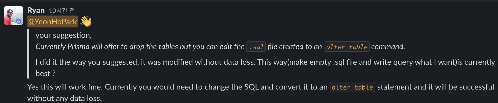

이번글의 주제는 Prisma migrate로 제가 정말 좋아하고 자주 사용하고 있는 기능입니다. Prisma migrate 덕분에 우리는 sql을 작성하지도 않고 DB를 조작할 수 있으며 또 DB조작기록을 관리할 수 있습니다. 다만 아직 cascade를 지원하지 않고, 또 몇몇 아쉬운 부분이 있습니다 😭

어쨋든 이번에는 Prisma migrate에 대해 하나씩 알아 보겠습니다.

_Prisma Migrate is an imperative database schema migration tool that enables you to make changes to your database schema. Migrations are auto-generated based on schema changes but are fully customizable._

[Prisma 공식문서](https://www.prisma.io/docs/concepts/components/prisma-migrate)에서는 Prisma migrate 위와 같이 정의하고 있습니다. 간단히 말해서<u> DB schema를 변경할 수 있는 tool</u>입니다. 간단하게 이정도로만 알고 있으면 될 것 같습니다.

```prisma
model User {
  id    Int      @id @default(autoincrement())
  name  String
  posts Post[]
}
model Post {
  id        Int     @id @default(autoincrement())
  title     String
  published Boolean @default(true)
  authorId  Int
  author    User    @relation(fields: [authorId], references: [id])
}
```

&nbsp;

# Prisma migrate 동작원리

사실 그냥 명령어만 입력해도 Prisma migrate를 사용하는데 큰 문제는 없지만, 만약 사용하는 도중 어떤 문제가 발생하였을 때, Prisma migrate가 어떻게 동작하는지 안다면 좀 더 유연하게 대처할 수 있습니다.

Prisma migrate가 굴러가는(?) 전체적인 흐름은 다음과 같습니다.

1. schema.prisma 생성(또는 변경)
2. draft migration file 생성
3. draft migration file을 DB schema에 적용

위의 과정이 전부입니다 ! user에 age라는 속성을 추가하고 migrate 명령어 치면 끝 !! 그럼 각 단계별로 어떤일이 발생하는지 자세하게 알아보겠습니다.

### 1. schema.prisma 생성(또는 변경)

우리는 User model에 age라는 속성을 넣어야 했다는 것을 개발하는 도중에 깨닫습니다(또는 model을 처음부터 작성하는 경우). 어쨋든 schema.prisma에 수정사항이 발생했습니다.

```
~~
  id    Int      @id @default(autoincrement())
  age   Int
  name  String
~~
```

&nbsp;

### 2.draft migration file 생성

여기서 draft는 "초안"이라는 의미인데, migration을 실제로 DB schema에 적용하는게 아니라 아직 초안만 작성한다는 의미입니다. Prisma 공식문서를 보면 pending이라는 말도 나오는데 "~을 기다리는 동안","메달려 있다"라는 의미로 draft와 같은 의미로 생각하시면 될 것 같습니다.

1단계에서 schema.prisma를 생성(수정)하고 다음 명령어를 실행합니다.

```
prisma migrate dev --create-only --preview-feature
```

⚠️ <u>npx prisma migrate dev --preview-feature 라는 명령어를 바로 입력해도 되지만 이렇게 되면 draft migration을 생성하는 동시에 바로 적용해 버립니다. 지금은 단계별로 하는 과정이므로 --create-only 옵션으로 합니다.</u>

이후 Migration이름을 입력하면 <u>prisma/migrations/</u>에 .sql파일이 생성됩니다. Prisma 공식문서에서 말하는 migration의 장점인 **이력관리**로 우리의 수정사항을 prisma/migration/에서 관리할 수 있습니다.

그리고 여기서 주목할 것은 prisma/migration/의 파일이 .sql이라는 것입니다. 우리는 단지 Prisma model만 작성해주었는데(심지어 쉽고 직관적입니다) Prisma가 알아서 sql파일을 만들어 줍니다. 이 파일을 draft migration이라고 하며 실제 DB schema에 적용됩니다.

&nbsp;

### 3.draft migration file을 DB schema에 적용

아직 우리가 2번 단계에서 만든 draft migration은 DB schema에 적용되기 전입니다. 우리는 다음의 명령어로 DB schema에 적용할 수 있습니다.

```
npx prisma migrate deploy --preview-feature
```

위의 명령어를 실행하면 draft migration이 모두 DB schema에 적용됩니다.

🤔 근데 가만, 우리는 User의 age라는 속성만 추가하고 싶은데, prisma/migration/에 있는 모든 내용들이 적용되면 ?

Prisma는 이런부분까지 다 신경쓰고 있습니다. 이미 적용된 migration을 적용되지 않게 하는 방법은 어떤 migration이 DB schema에 적용되었는지 체크하면 됩니다.

여기서 체크하는 곳이 \_prisma_migrations 테이블 인데요, 이 테이블은 앞서 2번 과정에서 draft migration을 생성할 때 만들어 집니다 !

이 부분에 대해서는 밑에서 다시 알아보겠습니다.

&nbsp;

# Prisma migration Synchronization

앞서 prisma migrate는 어떤 migration이 DB에 적용되었는지 체크한다고 하였습니다. 즉, prisma/migrations와 \_prisma_migration이 동기화 되어 있어야 합니다.

```
model User {
  id    Int      @id @default(autoincrement())
  name  String?
}

> npx prisma migrate dev --preview-feature
```

prisma migrate를 하면 아래의 결과물이 생성됩니다.

```
1. _prisma_migrations 생성
+----------------------+
| Tables_in_nexus_test |
+----------------------+
| _prisma_migrations   |
| User                 |
+----------------------+


2. prisma/migrations/20210227081759_init/migration.sql

-- CreateTable
CREATE TABLE `User` (
    `id` INTEGER NOT NULL AUTO_INCREMENT,
    `name` VARCHAR(191),

    PRIMARY KEY (`id`)
) DEFAULT CHARACTER SET utf8mb4 COLLATE utf8mb4_unicode_ci;
```

여기서 살펴볼 점은 \_prisma_migrations 테이블의 `migration__name` 필드의 값이 prisma/migrations/에 생성된 폴더명과 같다는 점인데요, 이렇게 두 정보가 같아야 prisma는 어떤 migration이 이미 DB에 적용되었는지 알 수 있습니다.

```
+--------------------------------------+----------------------------------------------------------------+-------------------------+---------------------+------+----------------+-------------------------+---------------------+
| id                                   | checksum                                                       | finished_at             | migration_name      | logs | rolled_back_at | started_at              | applied_steps_count |
+--------------------------------------+----------------------------------------------------------------+-------------------------+---------------------+------+----------------+-------------------------+---------------------+
| e8c7b2ae-0166-4040-8958-cffe91c41f0d | e89df9cd08873a9c16a282da7fc583da8c61ecddd2a7d61f96c5a3846016af | 2021-02-27 08:17:59.996 | 20210227081759_init | NULL | NULL           | 2021-02-27 08:17:59.989 |                   1 |
+--------------------------------------+----------------------------------------------------------------+-------------------------+---------------------+------+----------------+-------------------------+---------------------+
```

⚠️ 여기서 만약 \_prisma_migration이나 prisma/migration/에서 migration 이름을 수정하고 migrate를 진행하면 sync가 맞지 않다고 나옵니다.

이렇게 prisma 공식문서를 보거나 prisma migrate명령어를 실행하는데 `sync`에 대한 문제가 발생하면 먼저 위의 개념을 이해한 후에 문제해결에 접근하면 좋을 것 같습니다.

하지만, 두 기록이 제대로 일치한다고 하여도 `sync`가 맞지 않다며 `data loss` 경고를 보여주기도 합니다.

# --create-only, deploy

위에서 살펴본 것처럼`npx prisma migrate dev --preview-feature`를 실행하면 아래의 과정이 `한번에` 수행됩니다.

1. schema.prisma 수정
2. migrate 명령어 실행
3. draft migration 생성
4. DB schema에 적용 + \_prisma_migrations에 추가
5. generate artifacts

하지만 우리는 위의 과정을 한번에 수행하는 것이 아니라 단계별로 나누어서 수행할 수 있습니다. <u>단, 이렇게 나누어서 하는 경우 5번 과정을 수행되지 않습니다. 그렇기 때문에 prisma generate 명령어를 추가적으로 실행해 주어야 합니다.</u>

### --create-only

```
npx prisma migrate dev --create-only --preview-feature
```

1~5번 과정에서 3번까지 진행되며 `draft migration`만 생성하며 실제 DB schema에는 적용되지 않습니다.

❗️ 하지만, 만약 `draft migration`를 2번 연속으로 draft migration을 만드는 경우(첫번째 draft migration을 db schema에 적용하지 않고), 두번째 draft migration을 만들 때 첫번째 draft migration에 \_prisma_migrations 테이블과 db schema에 적용됩니다.

&nbsp;

### deploy

```
npx prisma migrate deploy --preview-feature
```

1~5번 과정에서 4번 과정만 수행합니다. draft migration을 실제 db schema에 적용하며 \_prisma_migrations에 row가 생성됩니다. 단 여기서, 변경된 구조로 @prisma/client가 업데이트 되지 않으므로 추가적으로 prisma generate 명령어를 수행해주어야 합니다.

&nbsp;

# column 변경, 추가, 삭제

migration으로 column으로 조작할 수 있습니다. 단, 여기서 조작하려는 DB column에 데이터가 존재하는 경우 어떻게 처리해야 하는지 알아봅시다.

<u>⚠️ Prisma 공식문서에는 migrate는 development에만 사용해야 하며 production에는 사용을 금지하고 있습니다.</u>

### column 변경

만약 db에 데이터가 없는 경우라면 schema.prisma에 column을 변경하고 prisma migrate를 하면 .sql 파일이 생성됩니다.

````
  Warnings:

  - You are about to drop the column `name` on the `User` table. All the data in the column will be lost.
  - Added the required column `name2` to the `User` table without a default value. This is not possible if the table is not empty.

-- AlterTable
ALTER TABLE `User` DROP COLUMN `name`,
    ADD COLUMN     `name2` VARCHAR(191) NOT NULL;
    ```
````

query를 보면 `name`을 drop하고 `name2`를 새로 만들고 있습니다. 또한 table에 데이터가 있는 경우 name2에 default를 정해줘야 한다고 말하고 있습니다.

그럼 데이터가 있을 때 column명을 수정하면 어떻게 될까요 ?

```
Error:
⚠️ We found changes that cannot be executed:

  • Step 0 Added the required column `name2` to the `User` table without a default value. There are 1 rows in this table, it is not possible to execute this migration.
```

그냥 name2로 변경하는 경우 위와 같은 에러가 나오게 되는데요, default value없이 column을 수정할 수 없다고 나옵니다(+ nullable하게 만들어도 가능합니다). 그렇기 때문에 우리는 다음과 같은 방법을 생각해볼 수 있습니다.

```prisma
1. name2 String @default("defaultValue")
2. name2 String?

                            ↓

⚠️  There will be data loss when applying the migration:

  • You are about to drop the column `name` on the `User` table, which still contains 1 non-null values.

? Are you sure you want create and apply this migration? Some data will be lost. › (y/N)
```

우리가 column명을 수정해도 prisma는 과거 column을 drop하고 새로운 column을 create하는 과정을 거치기 때문에 기존 data가 손실될 수 밖에 없습니다. 그리고 새로 생성된 column에는 default value 또는 nullable하게 만들어 기존 row에 영향이 없게 만들어 줘야 합니다.

그러면 data loss없이 column name을 바꿀 수는 없을까요 ?

이는 empty draft migration을 만들어서 우리가 직접 query를 작성해주면 되는데요, 이는 글의 마지막에 다시 알아보겠습니다.

&nbsp;

### column 추가

DB에 데이터가 없는 경우 column(age Int)을 추가하고 migrate를 실행하면 아래의 .sql 파일을 생성하게 됩니다.

```
  Warnings:

  - Added the required column `age` to the `User` table without a default value. This is not possible if the table is not empty.

-- AlterTable
ALTER TABLE `User` ADD COLUMN  `age` INTEGER NOT NULL;
```

query를 보면 `not null`으로 나오고 DB에 데이터가 존재하면 default value를 넣어주라고 하네요. column 변경과 같은 맥락인 것 같습니다.

마찬가지로 데이터가 존재하는 경우 추가하는 column에 default value 또는 nullable하게 만들어 주어야 합니다.

```
1. isMale Boolean?
2. isMale Boolean @default(true)

                          ↓

✔ Name of migration … add_isMale
The following migration(s) have been created and applied from new schema changes:

migrations/
  └─ 20210228163532_add_is_male/
    └─ migration.sql

✔ Generated Prisma Client (2.17.0) to ./node_modules/@prisma/client in 57ms

Everything is now in sync.
```

column 변경의 경우 default value, nullable하게 해도 column을 drop하고 create하는 하기 때문에 `Some data will be lost.` 경고가 나오지만 column 추가의 경우 단지 추가하는 것이기 때문에 아무런 경고도 보이지 않습니다.

### column 삭제

삭제하는 건 비교적 간단합니다. 그냥 삭제만 하면 되기떄문이죠. 데이터가 존재하지 않을 때 age column을 삭제하면 다음과 같은 .sql 파일이 생성됩니다.

```
  Warnings:

  - You are about to drop the column `age` on the `User` table. All the data in the column will be lost.

-- AlterTable
ALTER TABLE `User` DROP COLUMN `age`;
```

데이터가 존재하는 경우 age column을 삭제하면 다음과 같은 경고가 나옵니다.

```
⚠️  There will be data loss when applying the migration:

  • You are about to drop the column `age` on the `User` table, which still contains 1 non-null values.

? Are you sure you want create and apply this migration? Some data will be lost. › (y/N)
```

# migration customizing

우리가 migrate 명령어를 실행하면 자동으로 그에 맞는 query 명령어가 sql 파일에 생성됩니다. 하지만 만약 우리가 직접 query를 작성하고 싶은 경우는 어떻게 할까요 ?

위의 column name 변경을 보면 column name을 변경하고 migrate하고 난 후 생성된 query는 column을 `drop`하고 `create`하는 과정을 거칩니다. 그렇기 때문에 당연히 data loss가 발생할 수 밖에 없습니다.

🤔 _prisma가 column을 drop, create하는 이유는 아마, 변경된 name2라는 column이 `새로 생성된`건지 `변경된` 건지에 대한 정확한 기준이 없고 그냥 name이 없어졌기 때문에 drop, name2가 생성되었기 떄문에 create한다고 생각합니다...(아닐수도)_

하지만 데이터 손실없이 column 명을 변경할 수 있는 DDL이 있습니다. 우리는 이 명령어로 draft migration을 생성하고 deploy하면 됩니다 !

```
alter table user change name name2 varchar(191)
```

먼저 schema.prisma에 아무런 변경사항 없이 draft migration을 생성합니다. 그리고 생성된 .sql 파일에 위의 DDL을 넣고 deploy하면 <u>data 손실없이 column 명을 변경할 수 있습니다.</u> 정말 나이스한 방법입니다 !

물론 column 명을 변경하는 것 뿐만 아니라 여러분들이 하고 싶은 어떤 것들이든, 위의 방법으로 할 수 있습니다 !

사실 column name을 변경하기위해 여러 방법을 생각해봤는데요, 실질적으로 위의 방법이 최선의 방법인 것 같습니다.



## 📖 Reference

- <https://www.prisma.io/docs/concepts/components/prisma-migrate>
- <https://www.prisma.io/docs/concepts/components/prisma-migrate/prisma-migrate-flows>
- <https://slack.prisma.io/>
