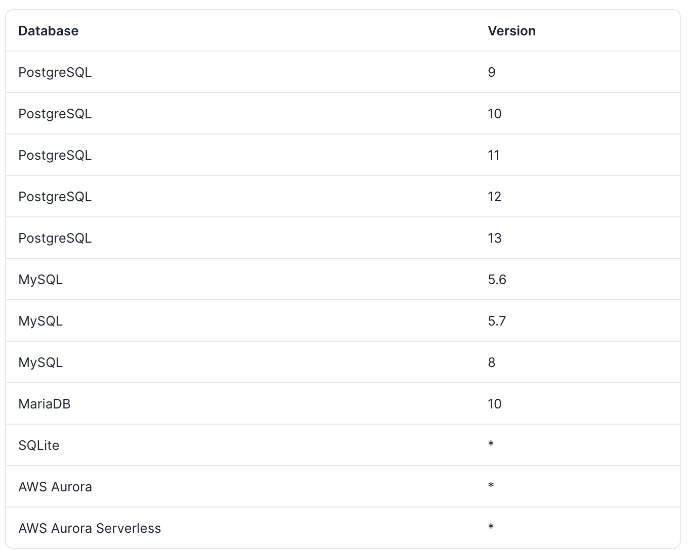

# Support RDB

현재 Prisma는 RDB를 기반의 여러 DBMS를 지원합니다. NoSQL은 아직 지원하지 않는 상태이며 [Prisma Roadmap](https://www.notion.so/Prisma-Roadmap-50766227b779464ab98899accb98295f)에서 `진행중인 작업`이라고 나와 있습니다. Prisma가 NoSQL을 어떤식으로 지원할지 궁금하네요🤔

Prisma가 현재 지원하는 DB는 아래와 같습니다.



RDB에서 관계는 핵심이며 이를 통해서 `무결성`을 보장하며 `join`을 사용하여 우리가 원하는 정보를 가져올 수 있습니다. 우리가 정의한 model을 통해서 실제 DB schema를 생성하는데 이때 model에서 정의한 field가 실제 DB상에 존재하지 않을 수 있습니다. 이는 model을 통해서 prisma crud api, type을 생성하기 때문입니다.

이번장에서는 기본적으로 아래의 model 구조를 사용하겠습니다.

```graphql
model User {
  id      Int    @id @default(autoincrement())
  posts   Post[]
  profile Profile?
}
model Profile {
  id      Int     @id @default(autoincrement())
  user    User    @relation(fields: [userId], references: [id])
  userId  Int     // relation scalar field (used in the `@relation` attribute above)
}
model Post {
  id         Int         @id @default(autoincrement())
  author     User        @relation(fields: [authorId], references: [id])
  authorId   Int         // relation scalar field  (used in the `@relation` attribute above)
  categories Category[]
}
model Category {
  id     Int     @id @default(autoincrement())
  posts  Post[]
}
```

Prisma에서 model간의 관계를 정의하는 방법은 총 3개가 있습니다.

- `1 : 1` : User ↔ Profile
- `1 : N` : User ↔ Post
- `N : M` : Post ↔ Category

&nbsp;

⚠️ 추가적으로 self relation이 있음

# 1 : 1 Relation

```graphql
model User {
  id        Int       @id @default(autoincrement())
  profile   Profile?
}

model Profile {
  id      Int    @id @default(autoincrement())
  user    User   @relation(fields: [userId], references: [id])
  userId  Int
}

                            ⬇

CREATE TABLE "User" (
    id SERIAL PRIMARY KEY
);

CREATE TABLE "Profile" (
    id SERIAL PRIMARY KEY,
    "userId" INTEGER NOT NULL UNIQUE,
    FOREIGN KEY ("userId") REFERENCES "User"(id)
);
```

일대일 (1 : 1) 관계는 관계의 양쪽에 최대 하나의 레코드가 연결될 수있는 관계를 나타냅니다. User와 Profile는 1:1관계이며 아래의 특징을 가집니다.

- User는 1 또는 0개의 Profile을 가짐(Profile이 optional이기 때문에)
- Profile은 무조건 User에 연결되어야 함

&nbsp;

📌 Profile의 userId가 `unique`로 되어 있습니다. 이는 Profile 모델에서 userId의 값이 고유한 값을 의미하며 이런 이유로 User와 Profile가 1:1 관계를 가지는 것은 타당합니다.

<u>만약 여기서 userId가 unique가 아니면 여러개의 userId가 존재할 수 있다는 의미가 되기 때문에 1:N 관계가 됩니다.</u>

&nbsp;

# 1 : N Relation

```graphql
model User {
  id        Int   @id @default(autoincrement())
  posts     Post[]
}
model Post {
  id        Int   @id @default(autoincrement())
  author    User  @relation(fields: [authorId], references: [id])
  authorId  Int
}

                            ⬇

CREATE TABLE "User" (
    id SERIAL PRIMARY KEY
);
CREATE TABLE "Post" (
    id SERIAL PRIMARY KEY,
    "authorId" integer NOT NULL,
    FOREIGN KEY ("authorId") REFERENCES "User"(id)
);
```

일대 다 (1 : N) 관계는 관계의 한쪽에있는 하나의 레코드가 다른쪽에있는 0 개 이상의 레코드에 연결될 수있는 관계를 나타냅니다. User와 Post는 1 : N관계이며 아래의 특징을 가집니다.

- User는 1 또는 N개의 Post를 가짐
- Post 무조건 author를 가져야함

&nbsp;

📌 Post의 authorId `unique`가 없습니다.이는 authorId가 중복된 값이 존재해도 된다는 것을 의미하기 때문에 1 : N관계를 가지는 것은 타당합니다.

<u> 여기서 authorId가 unique한 값이 된다면 1:1 관계가 됩니다.</u>

&nbsp;

⚠️ 여기서 잠깐
결국에 1:1와 1:N의 차이점이라곤 참조하는 id값의 unique 유무 입니다
`uniqeu가 있으면 1:1`  
`unique가 없으면 1:N`

&nbsp;

### 만약 User의 id값이 하나가 아닌 2개의 filed로 기본키를 만들면 ? 🤔

이경우 Post 테이블에 같은 이름의 [authorFirstName, authorLastName]를 여러개 입력할 수 있습니다.

- [apple1,banana1],[apple1,banana2] 가능 👍
- [apple1,banana1],[apple1,banana1] 불가능 ❌

```graphql
model User {
  firstName String
  lastName  String
  post      Post[]
  @@id([firstName, lastName])
}
model Post {
  id               Int      @id @default(autoincrement())
  author           User     @relation(fields: [authorFirstName, authorLastName], references: [firstName, lastName])
  authorFirstName  String
  authorLastName   String
}

                            ⬇

CREATE TABLE "User" (
    firstName TEXT,
    lastName TEXT,
    PRIMARY KEY ("firstName","lastName")
);
CREATE TABLE "Post" (
    id SERIAL PRIMARY KEY,
    "authorFirstName" TEXT NOT NULL,
    "authorLastName" TEXT NOT NULL,
    FOREIGN KEY ("authorFirstName", "authorLastName") REFERENCES "User"("firstName", "lastName")
);
```

## ❗️ required vs optional in 1 : N relation

optional을 추가할 때 다음의 경우를 고려할 수 있습니다

1. 1의 위치에서 optional

```graphql
  posts  Post[]    가능 👍
  posts  Post[]?   불가능 ❌
```

2. N의 위치에서 optional

```graphql
  author    User?  @relation(fields: [authorId], references: [id])
  ➡ authorId가 nullable

    author    User  @relation(fields: [authorId], references: [id])
  ➡ authorId가 not null
```

&nbsp;

# M : N Relation

다 대다 (M : N) 관계는 관계의 한쪽에 있는 0 개 이상의 레코드가 다른쪽에있는 0 개 이상의 레코드에 연결될 수있는 관계를 나타냅니다.

M : N관계는 1 : 1, 1 : N관계와 다르게 각각의 테이블간의 관계를 관리하는 `추가적인 테이블`을 만들어야 합니다. 여기서 추가적인 테이블을 만드는 방법에는 `함축적(implicit) 방법`과 `명시적(explicit) 방법`이 있습니다.

#### 1. 함축적 방법

```graphql
model Post {
  id   Int     @id @default(autoincrement())
  categories Category[]
}
model Category {
  id    Int    @id @default(autoincrement())
  posts Post[]
}

                            ⬇

CREATE TABLE "Category" (
    id SERIAL PRIMARY KEY
);
CREATE TABLE "Post" (
    id SERIAL PRIMARY KEY
);

CREATE TABLE "_CategoryToPost" (
    "A" integer NOT NULL REFERENCES "Category"(id),
    "B" integer NOT NULL REFERENCES "Post"(id)
);
CREATE UNIQUE INDEX "_CategoryToPost_AB_unique" ON "_CategoryToPost"("A" int4_ops,"B" int4_ops);
CREATE INDEX "_CategoryToPost_B_index" ON "_CategoryToPost"("B" int4_ops);
);
```

함축적 방법은 각각의 field type을 참조하는 모델의 배열 형태로 선언해 줍니다. 이렇게 하면 Prisma가 `자동으로` [naming convention](https://www.prisma.io/docs/concepts/components/prisma-schema/relations#conventions-for-relation-tables-in-implicit-m-n-relations)에 따라 새로운 테이블을 생성해 줍니다.

<u>생성된 `테이블명은 "\_"로 시작하며` 각각 `모델의 id를 참조하는 A,B 속성`이 만들어 집니다. **여기서 각 모델명의 알파벳순으로 먼저오는 것을 A, 뒤에오는 것을 B로 지정합니다.**
예를 들어 Apple, Banana 모델이 있을 때 Apple이 Banana보다 알파벳순으로 먼저 오기 때문에 A속성은 Apple의 id를 B는 Banana의 id를 참조합니다.</u>

함축적 방법으로 생성된 테이블은 model로써 존재하지 않기 때문에 Prisma CRUD API를 사용할 수 없습니다. 이 말은, `findUnique(), findMany()...` 등을 사용할 수 없다는 의미입니다. 하지만 Post, Category에서 `include`해서 사용할 수 있습니다.

⚠️ 만약 Prisma 자동으로 생성하는 테이블명이 마음에 들지 않으면 아래의 방법으로 직접 테이블 명을 지정할 수 있습니다 ❗️❗️

```graphql
model Post {
  id         Int         @id @default(autoincrement())
  categories Category[]  @relation("MyRelationTable")
}
model Category {
  id    Int     @id @default(autoincrement())
  posts Post[]  @relation("MyRelationTable")
}
```

&nbsp;

#### 2. 명시적 방법

```graphql
model Post {
  id         Int       @id @default(autoincrement())
  title      String
  categories CategoriesOnPosts[]
}
model Category {
  id    Int            @id @default(autoincrement())
  name  String
  posts CategoriesOnPosts[]
}
model CategoriesOnPosts {
  post        Post     @relation(fields: [postId], references: [id])
  postId      Int
  category    Category @relation(fields: [categoryId], references: [id])
  categoryId  Int
  createdAt   DateTime @default(now())

  @@id([postId, categoryId])
}

                            ⬇

CREATE TABLE "Category" (
    id SERIAL PRIMARY KEY
);
CREATE TABLE "Post" (
    id SERIAL PRIMARY KEY
);
-- Relation table + indexes -------------------------------------------------------
CREATE TABLE "CategoryToPost" (
    "categoryId" integer NOT NULL,
    "postId" integer NOT NULL,
    "createdAt" timestamp NOT NULL DEFAULT CURRENT_TIMESTAMP,
    FOREIGN KEY ("categoryId")  REFERENCES "Category"(id),
    FOREIGN KEY ("postId") REFERENCES "Post"(id)
);
CREATE UNIQUE INDEX "CategoryToPost_category_post_unique" ON "CategoryToPost"("categoryId" int4_ops,"postId" int4_ops);
```

명시적 방법은 M : N관계를 관리하는 `model을 직접 만들어서` 각각의 모델에서 생성된 model을 참조하는 방식입니다. `Post ↔ CategoriesOnPosts`와 `Category ↔ CategoriesOnPosts`가 각각 `1 : N 관계가 적용`되기 때문에 `@relation` 어노테이션을 지정해 주어야 합니다.

새로은 model에 참조하는 id속성 이외의 여러 `속성(createAt, updateAt...등)을 추가할 수 있으며` 실제 model을 만들었기 때문에 Post, Category 처럼 `Prisma CRUD API를 사용할 수 있습니다.`

또한 테이블명, 속성명들을 직접 지정할 수 있습니다.

&nbsp;

❗️ **명시적 방법 vs 함축적 방법**

|             | model 생성 | CRUD API | field, table 명 설정 |
| :---------: | :--------: | :------: | :------------------: |
| 함축적 방법 |     X      |    X     |  X(table명은 가능)   |
| 명시적 방법 |     O      |    O     |          O           |

&nbsp;

`함축적 방식`은 Prisma가 자동으로 테이블을 생성하며 코드상에서 CRUD API를 사용할 수 없습니다.

- relation model에 추가적인 정보(createAt, updateAt..)가 필요 없는 경우
- prisma introspection 사용하여 model을 만드는 경우 prisma relation convention에 따라 함축적 방식을 사용할 수 있음

&nbsp;

`명시적 방법`은 사용자가 직접 model을 만들 수 있고 코드상에서 CRUD API를 사용할 수 있습니다.

- 관계 모델의 속성명 등을 직접 지정하고 싶은 경우
- 관계 모델에 참조id 이외의 정보를 추가하고 싶은 경우
- 코드상에서 CRUD API를 사용하고 싶은 경우

&nbsp;

# self relations

관계에는 다른 모델을 참조하는 것이 아닌 자기 자신을 참조하는 관계도 있으며 이를 self relation이라고 합니다. self relation 항상 `@relation`을 필요로 하며 3가지 경우가 있습니다.

- `1 : 1`
- `1 : N`
- `N : M`

# 1 : 1 self relations

```graphql
model User {
  id          Int     @default(autoincrement()) @id
  name        String?
  successorId Int?
  successor   User?   @relation("BlogOwnerHistory", fields: [successorId], references: [id])
  predecessor User?   @relation("BlogOwnerHistory")
}

                            ⬇

CREATE TABLE "User" (
    id SERIAL PRIMARY KEY,
    "name" TEXT,
    "successorId" INTEGER
);
ALTER TABLE "User" ADD CONSTRAINT fk_successor_user FOREIGN KEY ("successorId") REFERENCES "User" (id);
ALTER TABLE "User" ADD CONSTRAINT successor_unique UNIQUE ("successorId");
```

⚠️ successor : 후임자, predecessor : 전임자

1:1 관계는 다음과 같은 특징을 가집니다.

- 두 relation 모두 `@relation`를 가지고 있어야 하며 같은 "BlogOwnerHistory" 처럼 같은 name을 공유하고 있어야 합니다.
- 두 relation 중 하나는 field, references 모두 가지고 있어야 합니다(위의 경우는 successor)
- 두 relation 중 하나는 외래키를 가지고 있어야 합니다(successor는 successorId를 가지고 있음)

&nbsp;

위의 구조를 표현하면 다음과 같습니다.

- User는 0 또는 1개의 전임자를 가질 수 있습니다.(jake는 블로그 소유자로서 Mark의 전임자입니다)
- User는 0 또는 1개의 후임자를 가질 수 있습니다.(Mark는 블로그 소유자로서 jake의 후임자 입니다)

&nbsp;

🧪 사실 이 부분은 저도 이해가 잘 안되니, 실제로 한번 테스트를 해보겠습니다.

```database
+----+-------+-------------+
| id | name  | successorId |
+----+-------+-------------+
|  1 | user1 |        NULL |
|  2 | user3 |        NULL |
+----+-------+-------------+
```

먼저 user1, user3을 만들었습니다. 곧 user2를 만들건데, user2에 대하여 user1은 전임자, user3은 후임자가 될 것입니다.

```database
  await prisma.user.create({
    data: {
      name: "user2",
      predecessor: {
        connect: {
          id: 1,
        },
      },
      successor: {
        connect: {
          id: 2,
        },
      },
    },
  });

                ⬇

+----+-------+-------------+
| id | name  | successorId |
+----+-------+-------------+
|  1 | user1 |           3 |
|  2 | user3 |        NULL |
|  3 | user2 |           2 |
+----+-------+-------------+
```

우리가 원하는 모습은 다음과 같습니다.

```
user1의 후임자는 user2
user2의 전임자는 user1, 후임자는 user3
user3의 전임자는 user2, 후임자는 미정
```

그럼 이제 결과물은 봅시다.

```
user1의 successorId(후임자)는 3, user2입니다.
user2의 successorId(후임자)는 2, user3입니다.
user3의 successorId(후임자)는 null, 미정입니다.
```

외래키를 successorId로 잡았기 때문에 predecessor(전임자)정보는 안나오는데 조회해보면 제대로 나오는 것을 확인할 수 있습니다.

```database

const result = await prisma.user.findUnique({
    where: {
      id: 3,
    },
    include: {
      predecessor: true,
    },
  });

  console.log(result);


{
  id: 3,
  name: 'user2',
  successorId: 2,
  predecessor: { id: 1, name: 'user1', successorId: 3 }
}
```

&nbsp;

# 1 : N self relations

```graphql
model User {
  id       Int      @id @default(autoincrement())
  name     String?
  teacherId Int?
  teacher  User?     @relation("TeacherStudents", fields: [teacherId], references: [id])
  students User[]   @relation("TeacherStudents")
}

                            ⬇

CREATE TABLE "User" (
    id SERIAL PRIMARY KEY,
    "name" TEXT,
    "teacherId" INTEGER
);
ALTER TABLE "User" ADD CONSTRAINT fk_teacherid_user FOREIGN KEY ("teacherId") REFERENCES "User" (id);
```

위의 구조를 표현하면 다음과 같습니다

- User는 0 또는 1개의 선생님을 가질 수 있습니다.
- User는 0 또는 N개의 학생을 가질 수 있습니다.

&nbsp;

🧪 마찬가지로 이해가 잘 안되니, 실제로 한번 테스트를 해보겠습니다.

```database
  await prisma.user.create({
    data: {
      name: "user1",
      students: {
        create: [
          { name: "user1-student1" },
          { name: "user1-student2" },
          { name: "user1-student3" },
        ],
      },
    },
  });

                            ⬇

+----+----------------+-----------+
| id | name           | teacherId |
+----+----------------+-----------+
|  1 | user1          |      NULL |
|  2 | user1-student1 |         1 |
|  3 | user1-student2 |         1 |
|  4 | user1-student3 |         1 |
+----+----------------+-----------+
```

user1에 여러명의 학생들이 등록된 것을 볼 수 있습니다. 마찬가지로 학생의 압장에서 선생님을 조회할 수 있습니다.

```database
async function main() {
  const result = await prisma.user.findUnique({
    where: {
      id: 4,
    },
    include: {
      teacher: true,
    },
  });

  console.log(result);

{
  id: 4,
  name: 'user1-student3',
  teacherId: 1,
  teacher: { id: 1, name: 'user1', teacherId: null }
}
```

&nbsp;

# N : M self relations

```database
model User {
  id          Int      @id @default(autoincrement())
  name        String?
  followedBy  User[]   @relation("UserFollows", references: [id])
  following   User[]   @relation("UserFollows", references: [id])
}

                            ⬇

CREATE TABLE "User" (
    id integer DEFAULT nextval('"User_id_seq"'::regclass) PRIMARY KEY,
    name text
);
CREATE TABLE "_UserFollows" (
    "A" integer NOT NULL REFERENCES "User"(id) ON DELETE CASCADE ON UPDATE CASCADE,
    "B" integer NOT NULL REFERENCES "User"(id) ON DELETE CASCADE ON UPDATE CASCADE
);
```

⚠️ N : M self relation의 경우 함축적(implicit)방법으로 테이블을 생성하였습니다.

&nbsp;

위의 구조를 표현하면 다음과 같습니다.

- User를 0 또는 N 명이 follow합니다.(follow 당하는 입장)
- User가 0 또는 N 명을 follow 합니다.(follow 하는 입장)

&nbsp;

🧪 이쯤되면 대충 흐름을 예상할 수 있겠지만 그래도 테스트 해보겠습니다.

```database
const user1 = await prisma.user.create({
      data: {
        name: "user1",
        following: { create: [{ name: "user2" }, { name: "user3" }] },
  },
});

                              ⬇

mysql> select * from user;
+----+-------+
| id | name  |
+----+-------+
|  1 | user1 |
|  2 | user2 |
|  3 | user3 |
+----+-------+
3 rows in set (0.00 sec)

mysql> select * from _UserFollows;
+---+---+
| A | B |
+---+---+
| 2 | 1 |
| 3 | 1 |
+---+---+
2 rows in set (0.00 sec)
```

&nbsp;

# ✋ Multiple self relation

model에서 하나의 self relation만 정의하는것이 아닌 여러개를 정의할 수도 있습니다. 생각해보면 User가 우리가 정의함에따라 여러가지 의미로 해석될 수가 있습니다.  
그렇게 때문에 아래와 같은 구조도 복잡하긴 하지만, 논리적으로는 문제없는 구조가 됩니다 👍

```graphql
model User {
  id          Int      @id @default(autoincrement())
  name        String?
  husband     User?    @relation("MarriagePartners")
  wife        User     @relation("MarriagePartners")
  teacher     User?    @relation("TeacherStudents")
  students    User[]   @relation("TeacherStudents")
  followedBy  User[]   @relation("UserFollows")
  following   User[]   @relation("UserFollows")
}
```

# 🎬 끝으로

이번에 Prisma relation을 한번 알아보았는데요, 예전에 instgram copy 토이프로젝트를 할 때 relation 부분을 많이 봤었는데, 다시 한번 정리할 수 있었습니다.

그리고 Prisma가 relation을 굉장히 유연하고 직관적으로 지원해준다는 느낌을 받았습니다.

## 📖 Reference

- <https://www.prisma.io/docs/concepts/components/prisma-schema/relations>
- <https://www.prisma.io/docs/about/roadmap>
- <https://www.prisma.io/docs/reference/database-reference/supported-databases>
