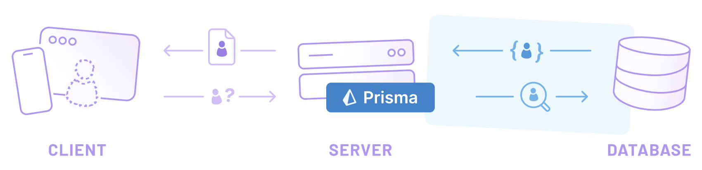
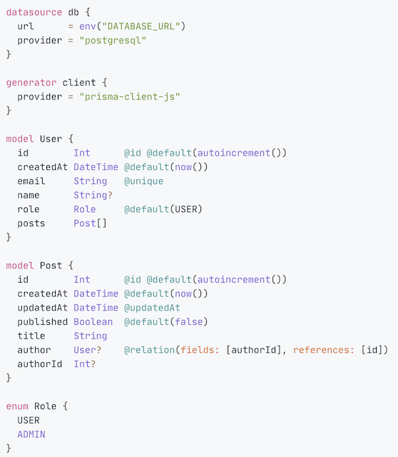
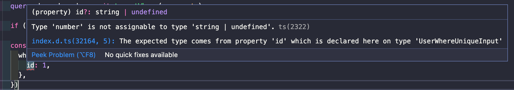
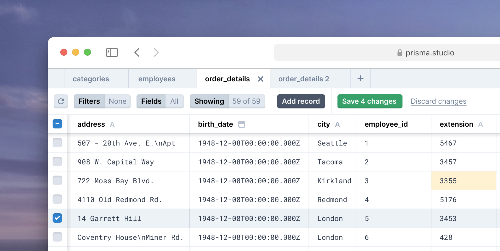

[인스타 그램 토이 프로젝트](https://github.com/pyh0414/instagram_copy)에서 처음 Prisma를 사용한 이후로 지금의 회사에서 까지 계속 사용하고 있다. 당시만 해도 Prisma1을 사용하고 있었는데 docker에 Prisma server를 올릴 때 마다 에러가 너무 많이 나서 고생했던 기억밖에 없다. 하지만 Prisma2으로 올라가면서 Prisma server가 없어지고 여러 기능들이 추가되면서 지금은 적당히 만족하면서 사용하고 있다.

release도 자주되고 오픈채팅방에서도 여러 사람들이 관심을 가지는 분위기니 앞으로의 행보가 기대되는 오픈소스 이다.

Prisma가 지원하는 기능과 특징이 너무나도 많기 때문에 여기서 모든것들을 설명하는 것은 힘들다. 때문에 간략하게 Prisma가 무엇인지 또 크게 어떤 기능들이 있는지만 알아 보고 가자.

혹시나 Prisma1와 Prisma2의 차이점에 대해 알고 싶으면 [여기](https://www.prisma.io/docs/guides/upgrade-guides/upgrade-from-prisma-1)를 참고하시면 된다.

## 🤔 Prisma가 ORM이야 ?

사실 Prisma1를 사용할 땐 Prisma가 정말 ORM인지 약간은 헷갈렸다. 애초에 ORM이 server/client로 나뉘는 것부터 이해가 안됐다. 밑의 사진에서 server는 Prisma client고 server와 DB사이에 Prisma server가 있었다. 뭐 예전이야 어쨋든 Prisma2로 넘어오면서 ORM의 모습이 갖춰졌고 Next-generation ORM으로 입지를 다지고 있는 것 같다.

[공식문서](https://www.prisma.io/), [Github](https://github.com/prisma/prisma)에서는 Prisma2 다양하게 소개하고 있다.

1. Prisma is a new kind of ORM that fundamentally differs from traditional ORMs and doesn't suffer from many of the problems commonly associated with these.

2. Prisma is a next-generation ORM that consists of these tools:

   - Prisma Client
   - Prisma Migrate
   - Prisma Studio

3. Prisma helps app developers build faster and
   make fewer errors with an open source ORM for PostgreSQL, MySQL and SQLite.

Prisma Client, Prisma Migrate, Prisma Studio 중에서 가장 중요한 것은 Prisma Client 가장 중요한 tool인데, Prisma Client를 Prisma라고 부르기도 한다.
실제로 [문서](https://www.prisma.io/docs/concepts/components/prisma-client)를 봐도 Prisma Client부분의 양이 엄청난 걸 알 수 있다. 실제로 우리가 ORM하면 생각하는 CRUD api 모두 Prisma Client에 정의되어 있다 그것도 아주 많은 기능이 유연하게.

우리는 그저 문서를 잘~읽고 어디서 사용할지 생각하기만 하면 된다 ❗️

## 👍 Prisma schema

TypeORM, Sequelize ..등 여타 ORM과 마찬가지로 Prisma역시 DB schema를 생성해주는 기능을 지원한다. 바로 Prisma schema인데 Prisma가 가진 아주 강력한 기능이다. 우리는 단지 schema.prisma에서 model을 정의하고 명령어만 입력하면 된다. 그러면 Prisma가 알아서 DB 스키마를 생성해준다.

무엇보다도 Prisma schema의 가장 큰 장점은 `직관적` `낮은 러닝커브`이다. TypeORM, Sequelize의 코드를 보고 있으면 마치 영어 문장을 해석하는 것 같다(개인적으로). 이런 부분이 우리 뇌를 불편하게 만든다.

반면에 Prisma schema의 경우 굉장히 직관적이며 내가 굳이 이해하려고 노력하지 않아도 쉽게 읽을 수 있다. 또한 러닝커브가 높지 않다. Prisma 문서는 무척이나 잘되어 있어서 그냥 읽고 사용하면 된다 ❗️

## 👍 Prisma Migrate + Prisma Introspection

내가 Prisma에서 가장 좋아하는 기능이다(~~사실 Prisma Migrate만 사용한다~~). 아직 Prisma팀에서 지원해주지 않는 기능들 떄문에 100% 만족하고 있지는 않지만 적당히 타협을 보면서 사용하고 있다. 언젠간 완벽해 지겠지😭

1. Prisma Migrate는 schema.prisma를 토대로 DB schema를 만들어 준다. 우리는 힘겹게 `create table User..`를 할 필요가 없다. 그냥 Prisme Migrate를 사용하면 된다. Prisma Migrate를 사용할 때 여러 옵션들이 있는데 이건 다음에 자세히 다룰 예정이다. 일단은 Prisma Migrate는 schema.prisma로 DB schema를 생성한다 정도만 알고 있자.

2. Prisma Introspection은 Prisma Migrate와 반대다. 만약 기존 서비스의 ORM을 Prisma로 바꾸는 경우 DB schema는 있는데 schema.prisma는 없다. 이때 Prisma Introspection을 사용하자. 기존의 DB schema를 사용하여 schema.prisma를 만들어 줄 것이다. 여기서 model, attribute들의 이름은 Prisma가 알아서 정해준다.

아직 아쉬운 점은 Prisma Migrate는 Production에 적용하기에는 아직 무리가 있다. Experimental단계에서 Preview단계로 올라간지 얼마 되지 않았고 공식문서에도 development 단계에서만 사용되도록 디자인 되었다고 한다. 얼른 Prisma의 기능들이 안정화 되었으면 좋겠다🙏

## 👍 Type safe + Auto-generated

사실 나도 Prisma를 사용하면서 Type safe, Auto-generated에 대해 깊게 생각해본 적이 없다. 공식문서에 자주 나오는 용여이지만 두루뭉술하게 이해하고 있을 뿐 실제로 Prisma에서 어떻게 사용되는지 몰랐다. 이참에 같이 한번 알아보자.

**_Type safe_**

Typsa safe라는 말은 `타입이 안정적`이라는 의미로 변수의 타입을 컴파일 시에 검사할 수 있다는 것을 의미하며 Prisma에서 말하는 Type safe는 `query의 유효성을 컴파일시`에 확인할 수 있음을 의미한다.

우리가 schema.prisma에 model을 정의하면 이를 기반으로 모든 Type들이 node_modules/@prisma/client에 정의된다(실제 Type들은 node_modules/.prisma/client/index.d.ts에 정의되어 있다).
이렇게 정의된 Type을 사용하여 Prism는 사용자가 api의 변수명, string을 입력해야 하는데 int를 입력한건 아닌지..등의 모든 유효성 체크를 정의된 Type들을 보고 다 확인한다.

이렇게 이미 정의된 Type들 덕분에 코드를 작성하면서 발생할 수 있는 여러가지 실수를 줄일 수 있다. 우리는 단지 Prisma가 던져주는 메시지를 읽고 수정하기만 하면 된다.

**_Auto-generated_**

우리는 Prisma migrate 덕분에 우리가 직접 SQL을 작성하지 않고 테이블을 생성/조작할 수 있다. 우리는 단지 schema.prisma에 model만 작성하면 Prisma가 알아서 SQL을 생성해주며 이후의 변경사항에 대해서도 모두 Prisma가 관리해준다.

뿐만 아니라 우리가 생성한 model에 대하여 모든 Type 역시 자동으로 생성해준다. 이는 위의 _Type safe_ 와 같은 얘기이다.

## 👍 Prisma Studio

Prisma Studio는 DB data를 위한 Visual Editor이다. 각각의 model별로 조작이 가능하며 굳이 개발자가 아니더라도 쉽게 사용할 수 있다. 분명히 좋은 툴은 맞지만, 하지만 왜 때문인지 나는 한번도 사용해본 적이 없다. 처음 개발할 때부터 QueryPie, Sequel Pro, DBeaver 같은 DB tool만 사용했기 때문에 굳이 사용해야 하는 필요성을 못느꼈다.

물론 나만 그렇다는 것이고 사용해도 좋은 tool이라고 생각한다. 최근에 2.15.0 release에서 dark mode가 나왔는데 생각보다 괜찮았다.

역시 검은색 🤘

## 📄 공식문서 + Slack

Prisma1부터 느낀 거지만 Prisma는 공식문서를 정말 잘 만들었다. 먼저 사용자의 입장에서 읽기 편하고 대부분의 기능이 공식문서를 찾아보면 다 나와있다. 또 예제 코드들도 많고 여러 추가적인 기능들이 잘 정리되어 있다.

예를들면 다음과 같은,,

1. [Prisma Blog](https://www.prisma.io/blog/)
2. [Prisma Roadmap](https://www.notion.so/Prisma-Roadmap-50766227b779464ab98899accb98295f)
3. [Example Project](https://www.prisma.io/docs/about/example-projects)
4. [Comparing Prisma](https://www.prisma.io/docs/concepts/more/comparisons)

5. ...

공식문서를 8~90%정도 다 읽어본 것 같은데(~~~대부분 까먹음..~~~), 그 후에도 심심할 때 한번씩 읽어보면 또 모르는 내용이 어디선가 튀어 나온다.

그리고 사용하다 잘 모르는 부분은 [Prisma slack](https://slack.prisma.io/)에 자유롭게 물어볼 수 있다. 좋은 점은, 일반 사용자분들도 대답을 잘 해주시지만 실제 Prisma 개발팀원 분들이 직접 댓글을 달아주시는게 좋았다. 실제 사용자들과 의사소통을 많이 한다는 점에서 Prisma라는 오픈소스에 대해 더욱 믿음이 갔다.
